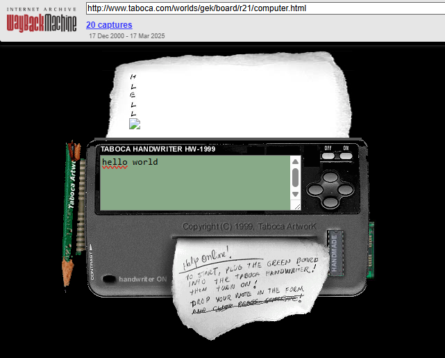
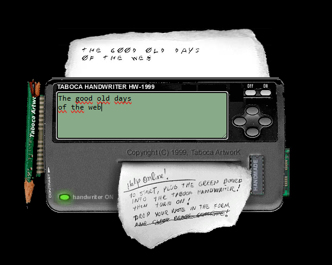

# Good Old Days DHTML Demo: Typewriter Demo from 1999

This project runs a restored local version of the old Taboca typewriter/computer demo.

## Before and After

Before: this forensic work involved identifying the demonstration from the web archive in the first place. I'm thankful that the demonstration was partly working, even though it was missing one of the characters and some layout was broken. 



After: the demonstration was brought back to life. The missing character was currently replaced. The missing character was, by the way, the letter O, and it was replaced by the character 0. The characters properly show on the right hand side. And it is all good as it used to be in 1999. 



## Videos

Video, part 1: [YouTube](https://www.youtube.com/watch?v=jUwwO47eeZM)

Video, part 2: [YouTube](https://www.youtube.com/watch?v=f1K1vJe2BIc)

Video, part 3: [YouTube](https://www.youtube.com/watch?v=msGUnG4TuDY)

Video, part 4: [YouTube](https://www.youtube.com/watch?v=vWAeZ6XHjh0)

Original demo copyright:
Marcio Galli, 1999

Original archived demo:
[Web Archive capture](https://web.archive.org/web/20001217101100/http://www.taboca.com/worlds/gek/board/r21/computer.html)

Related historical reading:
[2000 Good Old Days](https://www.mgalli.com/s/2000_good_old_days)

That page is a series of articles preserving some of the history of the Dynamic HTML days.

## Run locally

```bash
npm start
```

Then open:

http://127.0.0.1:1999/demo-typewriter/

## License

This restored repository is available under the MIT License, copyright 2026 Marcio Galli.

```text
MIT License

Copyright (c) 2026 Marcio Galli

Permission is hereby granted, free of charge, to any person obtaining a copy
of this software and associated documentation files (the "Software"), to deal
in the Software without restriction, including without limitation the rights
to use, copy, modify, merge, publish, distribute, sublicense, and/or sell
copies of the Software, and to permit persons to whom the Software is
furnished to do so, subject to the following conditions:

The above copyright notice and this permission notice shall be included in all
copies or substantial portions of the Software.

THE SOFTWARE IS PROVIDED "AS IS", WITHOUT WARRANTY OF ANY KIND, EXPRESS OR
IMPLIED, INCLUDING BUT NOT LIMITED TO THE WARRANTIES OF MERCHANTABILITY,
FITNESS FOR A PARTICULAR PURPOSE AND NONINFRINGEMENT. IN NO EVENT SHALL THE
AUTHORS OR COPYRIGHT HOLDERS BE LIABLE FOR ANY CLAIM, DAMAGES OR OTHER
LIABILITY, WHETHER IN AN ACTION OF CONTRACT, TORT OR OTHERWISE, ARISING FROM,
OUT OF OR IN CONNECTION WITH THE SOFTWARE OR THE USE OR OTHER DEALINGS IN THE
SOFTWARE.
```
